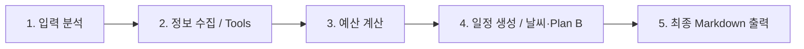
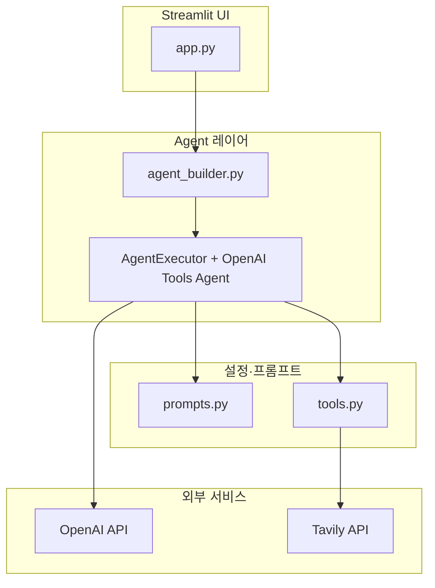

# 여행 계획 Agent (LLM_Agent)

OpenAI 함수 호출 기반 **LangChain Agent**와 **Streamlit** 웹 UI로, 사용자 입력(목적지·기간·예산·선호)을 바탕으로 **한국어 여행 계획서**를 생성하는 로컬 웹 애플리케이션입니다.  
검색·날씨·안전 정보 등은 **Tavily**를 통해 보강하고, 에이전트는 도구 호출 루프로 정보를 모은 뒤 Markdown 형식의 최종 답을 만듭니다.

---

## 이 서비스가 하는 일

- 자연어로 여행 요청을 받아 **일정·맛집·명소·교통·예산·날씨·안전** 관점을 종합한 계획을 제안합니다.
- 사이드바에서 **OpenAI 모델·Temperature·API 키**를 조정할 수 있습니다.
- 실행 중 **어떤 도구가 호출되었는지** Streamlit 콜백으로 실시간에 가깝게 보여 줍니다.
- `tools` / `prompts` 로딩에 실패하면 **Mock Agent**(고정 응답 도구)로 폴백할 수 있습니다(개발용).

---

## 전체 파이프라인

에이전트 시스템 프롬프트(`prompts.py`)는 사고 흐름을 아래 **5단계**로 유도합니다.



**런타임 기술 흐름**은 다음과 같습니다.

1. 사용자가 채팅 또는「빠른 시작」폼으로 질문을 보냅니다.
2. `app.py`가 `initialize_agent()`로 `AgentExecutor`를 구성합니다.  
   - `tools.ALL_TOOLS` → LangChain `@tool` 및 Tavily 래퍼  
   - `prompts.get_agent_prompt()` → 시스템 + 사용자 + `agent_scratchpad`  
   - `agent_builder.build_agent_executor()` → `create_openai_tools_agent` + 실행 한도(반복·시간)
3. `ChatOpenAI`가 도구 호출을 결정하고, 각 도구가 실행됩니다.  
   - 검색류는 대부분 **TavilySearchResults**로 웹 검색 결과를 가져옵니다.  
   - `calculate_d_day`, `calculate_budget_allocation`, `convert_currency_budget` 등은 코드/고정 환율로 계산합니다.
4. `StreamlitAgentCallbackHandler`가 도구 시작·종료를 UI에 반영합니다.
5. 최종 문자열이 채팅에 저장되고, `calculate_d_day` 결과가 있으면 응답 상단에 D-Day 블록이 붙습니다.

---

## 아키텍처



| 구성 요소 | 역할 |
|-----------|------|
| `app.py` | 페이지 설정, 세션 상태, 에이전트 초기화·실행, 콜백·채팅 UI |
| `agent_builder.py` | `AgentExecutor` 생성(최대 15회 반복, 120초 제한 등) |
| `prompts.py` | 5단계 파이프라인이 담긴 시스템 프롬프트, `get_agent_prompt()` |
| `tools.py` | 9개 도구를 `ALL_TOOLS`로 노출; Tavily 기반 검색 + 로컬 계산 도구 |

**도구 목록(요약)**  
`calculate_d_day`, `search_weather`, `search_restaurants`, `search_attractions`, `search_transportation`, `search_safety_warnings`, `convert_currency_budget`, `generate_weather_based_schedule`, `calculate_budget_allocation`

---

## 프로젝트 구조

```
LLM_Agent/
├── app.py              # Streamlit 진입점
├── agent_builder.py    # AgentExecutor 빌더
├── tools.py            # LangChain Tools (Tavily 등)
├── prompts.py          # 에이전트 시스템 프롬프트
├── requirements.txt
├── .env                # 로컬용 (gitignore, 직접 생성)
└── README.md
```

---

## 사전 요구 사항

- Python 3.10+ 권장  
- [OpenAI API 키](https://platform.openai.com/) (필수)  
- [Tavily API 키](https://tavily.com/) (검색 도구 동작에 권장; 없으면 해당 도구 호출 시 오류 가능)

코드는 `langchain_classic`(예: `AgentExecutor`, `create_openai_tools_agent`)을 사용합니다. `pip install -r requirements.txt` 후에도 import 오류가 나면 다음을 추가로 설치해 보세요.

```bash
pip install langchain-classic langchain-core
```

---

## 설치 및 실행

### 1. 저장소 클론 후 가상환경(선택)

```bash
cd LLM_Agent
python -m venv .venv
.venv\Scripts\activate
```

### 2. 의존성 설치

```bash
pip install -r requirements.txt
```

### 3. 환경 변수

프로젝트 루트에 `.env` 파일을 만들거나, Streamlit 사이드바에 직접 입력합니다.

| 변수 | 설명 |
|------|------|
| `OPENAI_API_KEY` | OpenAI 호출용 (필수) |
| `TAVILY_API_KEY` | Tavily 검색용 (권장) |

`.env` 예시:

```env
OPENAI_API_KEY=sk-...
TAVILY_API_KEY=tvly-...
```

`python-dotenv`를 쓰는 경우, 앱 실행 전에 환경을 로드하려면 터미널에서 export 하거나, 필요 시 `app.py` 상단에 `load_dotenv()` 호출을 추가할 수 있습니다(현재 저장소 기준으로는 사이드바 입력·OS 환경 변수에 의존).

### 4. 앱 실행

```bash
streamlit run app.py
```

브라우저에서 표시되는 로컬 URL(기본 `http://localhost:8501`)로 접속합니다.

---

## 사용 팁

- **빠른 시작**: 목적지·기간·예산·선호를 입력 후「여행 계획 요청」또는 예제 버튼을 사용할 수 있습니다.
- **Mock Agent**: 사이드바의「Mock Agent 사용」을 켜면 Tavily/팀 도구 없이도 UI 동작을 시험할 수 있습니다(응답은 샘플에 가깝습니다).
- **모델**: 기본값은 `gpt-4o-mini`이며 `gpt-4o`, `gpt-4-turbo` 중 선택 가능합니다.

---

## 라이선스 및 주의

- 검색·날씨·환율 등은 **도구 구현과 외부 검색 결과에 의존**하므로, 실제 여행 전에는 공식 정보와 교차 확인하는 것이 좋습니다.
- `convert_currency_budget`의 환율은 예시 값이 포함되어 있으므로 **실제 환전/결제에는 사용하지 마세요.**
